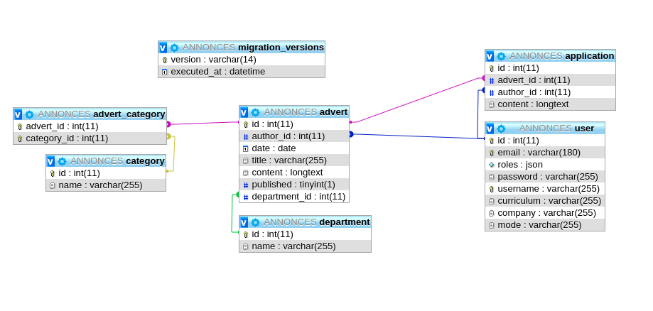

# Ads

## 3WA/SensioLabsUniversity Project

  
#### Travis CI   
#### Scrutinizer CI   
#### Circle CI   
#### Appveyor CI   
#### Codeship CI 

### First step

-  [Template](https://www.free-css.com/free-css-templates/page220/gp)
- User Entity created (with constraints and Unique Entity)
- plainPasswordField
- SecurityController with register, login and logout methods.
- Set up config/packages/security.yaml (encoder, provider and firewall).
- RegistrationFormType.
- login.html.twig and register.html.twig
- AgreeTerms and remember_me
- UserFixtures
- Condition "is_granted" in navbar.

Security DOC:  
[SF DOC Security](https://symfony.com/doc/current/security.html)   
[SFDOC LOGIN FORM](https://symfony.com/doc/current/security/form_login_setup.html)  
[SF DOC form_login Authentication Provider](https://symfony.com/doc/current/security/form_login.html)  
[SF DOC remember me functionality](https://symfony.com/doc/current/security/remember_me.html)  
[SF DOC CSRF protection](https://symfony.com/doc/current/security/csrf.html)
[SF DOC registration form](https://symfony.com/doc/current/doctrine/registration_form.html)  
[SymfonyCasts Security](https://symfonycasts.com/screencast/symfony-security)

- Advert Entity created (with constraints and Unique Entity)  
- relation ManyToOne with User Entity (author field).
- AdvertController, AdvertFixtures, for loop in Twig to see all adverts.
- Twig view to see one advert.
- Pagination done.
- AddAdvertType form created.
- CRUD done with this entity.

DOC:  
[SF DOC Doctrine](https://symfony.com/doc/current/doctrine.html)  
[SF DOC Relations](https://symfony.com/doc/current/doctrine/associations.html)  
[SF DOC Fixtures](https://symfony.com/doc/current/bundles/DoctrineFixturesBundle/index.html)  
[SF DOC Validation](https://symfony.com/doc/current/validation.html)  
[SymfonyCasts Pagination](https://symfonycasts.com/screencast/doctrine-relations/pagination)  

- Application Entity created
- relation ManyToOne with User Entity (author field)
- relation ManyToOne with Advert Entity (advert field)
- ApplicationController,  ApplicationType form.
- possibility to send an application to an advert.

### Step 2

- Category Entity created (with constraints and Unique Entity)
- relation ManyToMany with Advert Entity ( categories field).
- addAdvertType modified (EntityType, class Category, multiple)
- CategoryFixtures and categories can be seen in templates (index & view.html.twig)
- Add and Edit an advert with some categories works.
- We have now 4 entities :
1) User related to Advert (OneToMany) and Application (OneToMany).
2) Advert related to User (ManyToOne), Application (OneToMany) and Category (ManyToMany).
3) Application related to User (ManyToOne) and Advert (ManyToOne).
4) Category related to Advert (ManyToMany).

### Step 3

- Department Entity created 
- relation OneToMany with Advert Entity (department field).
- DepartmentType form created.
- addAdvertType modified including DepartmentType so that we can see now where the advert is.
- DepartmentFixtures has been done with all french departments.
- Admin part has been enhanced:
- Admin can now change the User's role.
- Admin can now validate an advert.
- Admin can add or delete a category.

### Step 4

- Start Account Page
- Possibility to see my created adverts
- Possibility to see applications for those adverts.
- Add Flash messages.

### Step 5

- User can upload his curriculum vitae now.
- Roles have been defined: ROLE_RECRUITER and ROLE_CANDIDATE
- When registering, we must choose recruiter or candidate with a ChoiceType form.
- So in Twig, you don't see the same things wether you're a recruiter or not.
- UserFixtures changed consequently.
- A UploadFile Service has been done and used in AccountController.
- installed phpunit-bridge
- installed browser-kit
- installed css-selector
- vendor/bin/simple-phpunit (see Tests)
- vendor/bin/simple-phpunit --coverage-html {path} (see Tests in a browser)
- vendor/bin/simple-phpunit --testdox (pour voir ce qui est testé)
- vendor/bin/simple-phpunit --testdox-html {path} 
- Natif à PHP5.6: phpdbg -qrr phpunit --coverage-html=.... (il faut XDEBUG: php --ri xdebug)
- Pour les tests, je désinstalle simple-phpunit et je passe par [test-pack](https://packagist.org/packages/symfony/test-pack)
- Puis bin/phpunit
- bin/phpunit --coverage-html var/phpunit
DOC:  
[SYMFONY DOC UPLOAD FILE](https://symfony.com/doc/current/controller/upload_file.html)  
[SYMFONY DOC HIERARCHICAL ROLES](https://symfony.com/doc/current/security.html#hierarchical-roles)  

### Step 6: a bit of quality/performance

- install PHPMetrics (vendor/bin/phpmetrics --report-html=doc/phpmetrics ./src )  
- install PHPCodeSniffer (vendor/bin/phpcs et vendor/bin/phpcbf)
- install PHPMessDetector (vendor/bin/phpmd src/ html unusedcode --reportfile phpmd.html)  
- install PHP Copy/Paste Detector (vendor/bin/phpcpd . )
- install Behat
- Badge Scrutinizer
- Badge CodeClimate

[PHPMetrics](https://github.com/phpmetrics/PhpMetrics)  
[PHPCodeSniffer](https://github.com/squizlabs/PHP_CodeSniffer)  
[PHPMessDetector](https://github.com/phpmd/phpmd)  
[PHP Copy/Paste Detector](https://github.com/sebastianbergmann/phpcpd)  
[DOC PHPMD](https://phpmd.org/rules/index.html)  
[Behat](https://packagist.org/packages/behat/behat) 

### Step 7: makefile

- tests, quality, install
- Beware of indentation: cat -e -t -v makefile 

### Step 8: CI

- [Travis CI](https://travis-ci.org/) (Voir fichier .travis.yml à la racine).
- [Scrutinizer CI](https://scrutinizer-ci.com)
- [Circle CI](https://circleci.com/) (Voir .circleci/config.yml à la racine).
- [Codeship CI](https://codeship.com/) (configuration online/Vérifier version PHP).

DOC SYMFONY && autres:  
[Testing](https://symfony.com/doc/current/testing.html)  
[Customize Bootstrap Process before Running Tests](https://symfony.com/doc/current/testing/bootstrap.html)  
[Tests](https://symfony.com/doc/current/best_practices/tests.html)  
[PHPUNIT](https://phpunit.de/)  
[Simulate HTTP Authentication in a Functional Test](https://symfony.com/doc/current/testing/http_authentication.html)  
[Test Code interacting with the database](https://symfony.com/doc/current/testing/database.html)  
[Test Doctrine repositories](https://symfony.com/doc/current/testing/doctrine.html)  
[DOMCrawler Component](https://symfony.com/doc/current/components/dom_crawler.html)  
[CssSelector Component](https://symfony.com/doc/current/components/css_selector.html)

Voir également:  
[Jenkins](https://jenkins.io/)  
[TeamCity](https://www.jetbrains.com/teamcity/)  
[Gitlab CI](https://about.gitlab.com/product/continuous-integration/)  
[Buddy](https://buddy.works/)  

